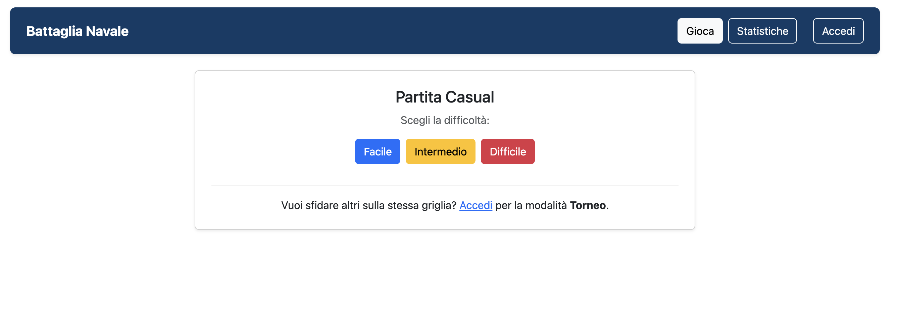
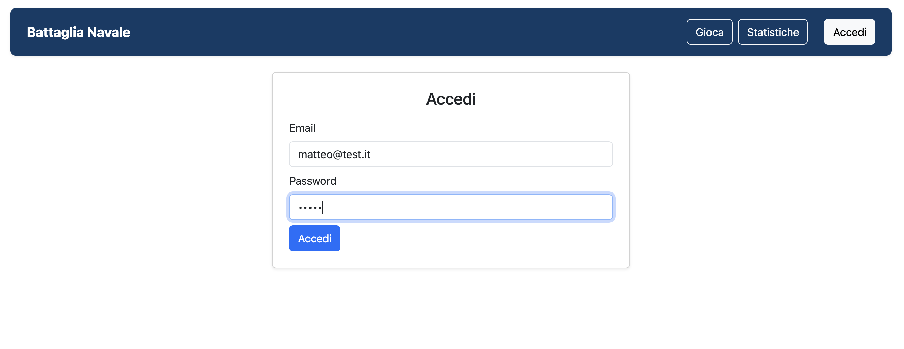
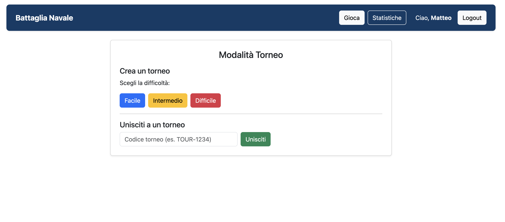
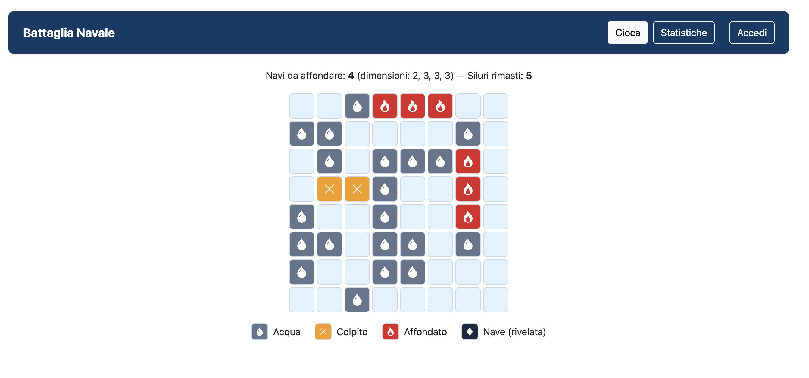
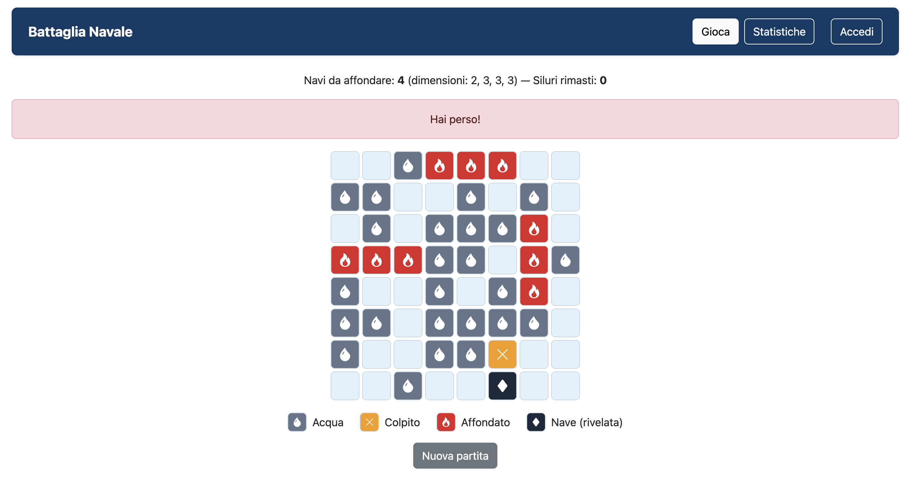
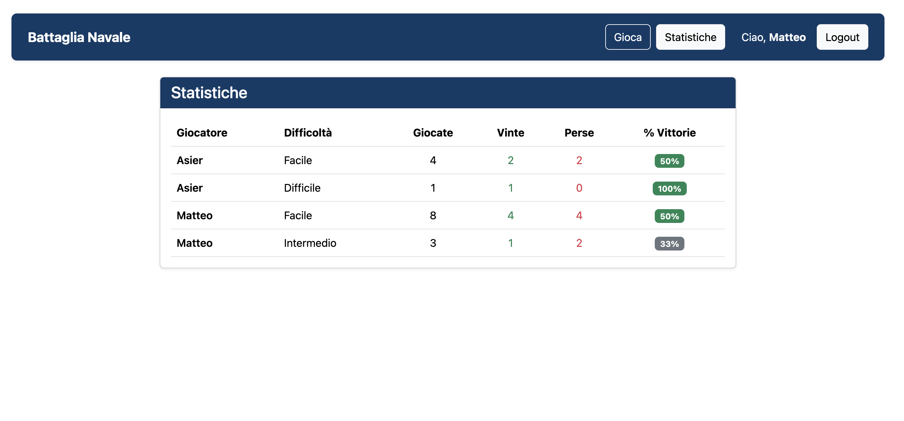

[](https://classroom.github.com/a/W4bhbCo5)
# Exam #2: "Battaglia Navale"
## Student: ZYLFO MATTEO

## Come avviare il progetto

**Prerequisiti:** [Node.js](https://nodejs.org/) (LTS) e npm.

1. **Clona il repository:**
   ```bash
   git clone https://github.com/mzylfo/battaglia-navale-mzylfo.git
   cd battaglia-navale-mzylfo
   ```

2. **Avvia il server** (in un terminale):
   ```bash
   cd server
   npm install
   node index.js
   ```
   Il server è disponibile su `http://localhost:3001`. In alternativa, per il riavvio automatico ad ogni modifica, si può usare `npx nodemon index.js`.

3. **Avvia il client** (in un secondo terminale):
   ```bash
   cd client
   npm install
   npm run dev
   ```
   Apri il browser su `http://localhost:5173`.

4. **Accedi con un utente di prova:** il database (`server/database.db`) è già precaricato con 3 utenti — le credenziali sono elencate nella sezione [Users Credentials](#users-credentials) più sotto. Oppure gioca subito una partita **Casual** senza effettuare il login.

## React Client Application Routes

- Route `/`: è la pagina principale del gioco. Da anonimo mostrata la scelta della difficoltà in modalità Casual; da autenticato viene mostrata la modalità Torneo in cui è possibile crearne uno o unirsi ad uno pre-esistente; durante una partita viene mostrata la griglia di gioco, i siluri rimasti e la legenda.
- Route `/stats`: pagina pubblica - visibile anche agli anonimi -  con la tabella delle statistiche per ogni giocatore e livello di difficoltà.
- Route `/login`: viene mostrato il form di login. Se l'utente è già autenticato viene reindirizzato a `/`.
- Route `*`: qualsiasi altro URL reindirizza a `/`.

## API Server

### Partite (gioco)

- **POST `/api/games`** — Avvia una nuova partita in modalità Casual (accessibile anche agli utenti anonimi).
  - Request body: `{difficulty}` dove `difficulty` è uno tra `easy`, `medium`, `hard`.
  - Il server genera e posiziona la flotta nella griglia, crea la partita (`user_id` nullo, `status = playing`) e ne salva le navi.
  - Response `201`: `{gameId, gridSize, shipSizes, torpedoesTotal, torpedoesLeft}`. Le posizioni delle navi non vengono mai inviate.
  - Errori: `422` difficoltà non valida, `500` errore del server.

- **POST `/api/games/:id/shots`** — Lancia un siluro in una cella (accessibile anche agli anonimi).
  - Parametro URL: `:id` = id della partita. Request body: `{row, col}`.
  - Il server calcola l'esito del lancio in un valore tra `water`, `hit` o `sunk`, salva il colpo, aggiorna i siluri, segna la nave come affondata se necessario e aggiorna lo stato (`won` se tutte le navi sono affondate, `lost` se i siluri finiscono).
  - Response `200`: `{result, torpedoesLeft, status}`.
    - Se il colpo affonda una nave, aggiunge `sunkCells: [{row, col}, ...]`, ovvero le celle dell'intera nave affondata, già colpite dal giocatore.
    - Se la partita termina, aggiunge `ships: [...]` con la posizione di tutte le navi che vengono rivelate solo a fine partita.
  - Errori: `404` partita inesistente, `422` partita già finita / cella fuori griglia / cella già colpita, `500` errore del server.

### Tornei (solo utenti autenticati)
- **POST `/api/tournaments`** — Crea un nuovo torneo e la partita del creatore.
  - Request body: `{difficulty}`.
  - Il server genera un codice testuale univoco, crea il torneo e la partita del creatore (collegata all'utente e al torneo) con la relativa flotta.
  - Response `201`: `{code, gameId, gridSize, shipSizes, torpedoesTotal, torpedoesLeft}`. Il `code` può essere condiviso con gli altri giocatori.
  - Errori: `401` non autenticato, `422` difficoltà non valida, `500` errore del server.

- **POST `/api/tournaments/join`** — Unisciti a un torneo esistente tramite codice.
  - Request body: `{code}`.
  - Il server cerca il torneo dal codice, verifica che l'utente non abbia già giocato quel torneo, poi crea una nuova partita copiando la stessa disposizione di navi, griglia e difficoltà.
  - Response `201`: `{code, gameId, gridSize, shipSizes, torpedoesTotal, torpedoesLeft}` ovvero la stessa griglia degli altri partecipanti.
  - Errori: `401` non autenticato, `404` codice inesistente, `409` torneo già giocato dall'utente, `500` errore del server.

### Statistiche

- **GET `/api/stats`** — Statistiche pubbliche (accessibili a tutti, anche agli anonimi).
  - Non abbiamo bisogno di nessun parametro. 
  - Il server aggrega le partite concluse (`won`/`lost`) degli utenti registrati, raggruppate per giocatore e difficoltà. Le partite Casual (anonime) sono escluse.
  - Response `200`: array di `{name, difficulty, total, won, lost, winRate}`, dove `total` = partite giocate e `winRate` = percentuale di vittorie.

### Sessioni (autenticazione)

- **POST `/api/sessions`** — Login tramite Passport.
  - Request body: `{username, password}` - lo `username` è l'email dell'utente.
  - Response `201`: `{id, username, name}`. Errore `401` se le credenziali sono errate.

- **GET `/api/sessions/current`** — Ritorna l'utente della sessione corrente.
  - Response `200`: `{id, username, name}`. Errore `401` se nessun utente è autenticato.

- **DELETE `/api/sessions/current`** — Logout: distrugge la sessione dell'utente corrente. Response `200`.

## Database Tables

- Table `users` - utenti registrati: `id`, `email`, `name`, `hash`, `salt`.
  Un utente può avere molte partite (1:N con `games`).
- Table `games` - una riga per partita: `id`, `user_id` (NULL se Casual), `tournament_id` (NULL se non è un torneo), `difficulty`, `grid_size`, `torpedoes_total`, `torpedoes_left`, `status`, `created_at`.
  Ogni partita appartiene a 0..1 utente e a 0..1 torneo; ha molte navi e molti colpi (1:N con `ships` e `shots`).
- Table `ships` - navi di ogni partita: `id`, `game_id`, `size`, `start_row`, `start_col`, `orientation`, `sunk`.
  Ogni nave appartiene a 1 sola partita (N:1 con `games`).
- Table `shots` - siluri lanciati: `id`, `game_id`, `row`, `col`, `result`.
  Ogni colpo appartiene a 1 sola partita (N:1 con `games`).
- Table `tournaments` - tornei con codice condiviso: `id`, `code`, `created_at`.
  Un torneo può avere molte partite (1:N con `games`).


## Main React Components

- `App` (in `App.jsx`): componente radice dell'applicazione. Mantiene tutto lo stato del gioco (`game`, `shots`, `torpedoesLeft`, `status`, `revealedShips`) e dell'autenticazione (`loggedIn`, `user`). All'avvio controlla la sessione con un `useEffect`. Definisce le route con react-router (`/`, `/stats`, `/login`) e la navbar. Contiene i gestori principali: `startGame`/`startTournament`/`handleJoin` (creano o entrano in una partita chiamando le API e reimpostano lo stato tramite `beginGame`), `handleShoot` (lancia un siluro, aggiorna la griglia e colora l'intera nave affondata), `handleLogin`/`handleLogout`. Passa stato e funzioni alle pagine figlie.

- `HomePage` (in `HomePage.jsx`): schermata della route `/`. Da utente anonimo mostra la scelta della difficoltà (Casual); da utente autenticato mostra la modalità Torneo (`TournamentSetup`).

- `GamePage` (in `GamePage.jsx`): schermata di una partita in corso o terminata. Mostra il numero e le dimensioni delle navi, i siluri rimasti, la griglia (`Board`), la legenda e i messaggi di vittoria/sconfitta.

- `LoginPage` (in `LoginPage.jsx`): pagina della route `/login`; racchiude il form di login (`LoginForm`) in una card centrata.

- `Board` (in `Board.jsx`): riceve la partita corrente, la lista dei colpi e le navi rivelate. Costruisce la griglia NxN; per ogni cella determina lo stato controllando se è stata colpita (acqua/colpito/affondato), se appartiene a una nave rivelata (a fine partita) o se è vuota. Disegna un `Cell` per ogni posizione e inoltra i click con `onShoot`.

- `Cell` (in `Cell.jsx`): rappresenta una singola cella della griglia. Riceve il proprio `state` e una funzione `onClick`. Sceglie una classe CSS (il colore) e un'icona Bootstrap in base allo stato (goccia = acqua, X = colpito, fiamma = affondato, rombo = nave rivelata). È cliccabile solo quando è vuota, per lanciare un siluro.

- `TournamentSetup` (in `TournamentSetup.jsx`): mostrato agli utenti autenticati nella home. Offre i pulsanti per creare un torneo (scelta della difficoltà, tramite `onCreate`) e un form controllato per unirsi con un codice (tramite `onJoin`). Gestisce un messaggio d'errore locale: se l'unione fallisce (codice errato o torneo già giocato) intercetta l'errore e lo mostra.

- `LoginForm` (in `LoginForm.jsx`): form di login con due input controllati (email e password) e il relativo stato locale. Al submit impedisce il ricaricamento della pagina, chiama `onLogin` passata dal padre e, in caso di fallimento, mostra un avviso rosso con l'errore di credenziali.

- `StatsPage` (in `StatsPage.jsx`): pagina delle statistiche. Con un `useEffect` carica dal server le statistiche pubbliche una volta all'apertura, le salva nello stato e le mostra in una tabella (una riga per giocatore e difficoltà: giocate, vinte, perse, percentuale); mostra un messaggio se non ci sono dati o in caso di errore.

- `Legend` (in `Legend.jsx`): piccola legenda disegnata sotto la griglia; elenca i quattro stati delle celle (acqua, colpito, affondato, nave rivelata) ognuno con il suo colore e la sua icona, per aiutare a leggere la griglia.


## Screenshot

### Schermata principale


### Login


### Modalità Torneo


### Partita in corso


### Partita persa


### Statistiche



## Users Credentials

- `matteo@test.it`, `pass1` (ha giocato alcune partite)
- `asier@test.it`, `pass2` (ha giocato alcune partite)
- `queso@test.it`, `pass3` (nessuna partita)

## Use of AI Tools
Ho usato un assistente AI (Claude) per: chiarire ed estendere i concetti teorici principali, impostare l'architettura, trovare bug, rivedere il codice e per scrivere parte della grafica (CSS). La logica principale di gioco e server è stata scritta dal sottoscritto seguendo la traccia ed eventuali accorgimenti dell'AI.
